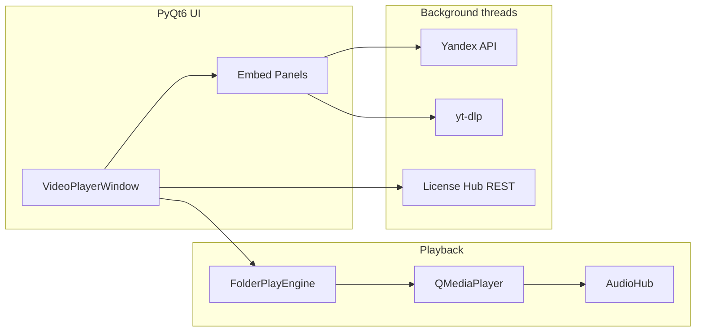

# MediaPolka

**A Windows desktop media workstation for folder-based playback, library curation, and multi-platform streaming ingestion.**

MediaPolka turns any local directory into a hands-free playlist player for video, audio, and image slideshows—while embedding optional pipelines to search, stream, and download content from Yandex Music, YouTube, VK, RuTube, Telegram, TikTok, and Instagram. It targets creators and power users who need **one native app** instead of juggling a file manager, browser tabs, and separate download tools.

> **Note for reviewers:** This is a production-grade **Python + PyQt6** desktop application with real licensing, packaging, and Windows audio integration. It does **not** train or serve custom ML models; its “intelligent” layer is **metadata extraction, resilient API/media pipelines, and automation** around third-party platforms.

---

## Key Features

### Core (free / local)

| Area | Capabilities |
|------|----------------|
| **Local playback** | Sequential playlist from a folder: MP4/MKV/AVI/MOV/WebM, MP3/FLAC/WAV, images (5 s slides) |
| **Library UX** | Random & loop modes, subfolder scanning, 0–10 star ratings, sort-by-rating, searchable file list |
| **File ops** | In-app rename, move-to-folder targets, delete-to-recycle-bin, **undo stack** (Ctrl+Z) |
| **Player UX** | Fullscreen (F11), mini player, system tray, transport zones (prev / pause / next), timeline seek |
| **i18n** | Russian / English UI toggle |
| **Windows audio** | Per-process output routing to Bluetooth speakers (`winappaudiorouter` + WASAPI heuristics) |
| **Embeds (no subscription)** | VK, RuTube, Telegram, TikTok, Instagram panels — search/URL → stream or download via **yt-dlp** |

### PRO (account subscription)

| Feature | Description |
|---------|-------------|
| **Yandex Music** | OAuth token auth, liked tracks & search (batched API), local download, in-app playback |
| **YouTube** | Search & URL playback/download with cookie-browser fallback for age-restricted content |

PRO is enforced client-side via `LicenseHubClient` (`license_hub.py`) against the IT Solutions Hub API (HWID-bound device, bearer token, 72 h offline grace).

---

## Tech Stack & Architecture

### Languages & runtime

- **Python 3.12+** (embeddable/portable bootstrap supported)
- **Windows 10/11 x64** (primary target; uses native multimedia stack)

### UI & multimedia

| Layer | Technology |
|-------|------------|
| GUI | **PyQt6** (`QMainWindow`, custom widgets, iOS-style toggles) |
| Video output | **Qt Multimedia** + `QVideoWidget` |
| Audio | Single shared **`QAudioOutput`** (`AudioHub` in `media_audio.py`) attached to the active `QMediaPlayer` |
| Windows mixer | **pycaw** + **comtypes** — unmute/volume for `pythonw.exe` / app process |

### Media ingestion & APIs (not on-device ML)

| Integration | Library / approach |
|-------------|-------------------|
| YouTube, VK, RuTube, Telegram, TikTok | **yt-dlp** with retry, browser-cookie fallback, FFmpeg path discovery |
| Yandex Music | **yandex-music** SDK — `Client.init()`, batched `tracks()` for likes (100 IDs/call) |
| Instagram | Hybrid: **yt-dlp** + mobile GraphQL-style HTTP (`instagram_api.py`), shortcode → media PK decoding |
| Licensing | **requests** REST client, SHA-256 HWID from WMI / `MachineGuid` |

### Concurrency model

- **Qt main thread** for UI and `QMediaPlayer`
- **`threading.Thread`** for network I/O: license checks, Yandex/YouTube loads, cover art, downloads
- **`QTimer`** + signal bridges (`pyqtSignal`) to marshal results back to the GUI
- No asyncio event loop in the app core (sync `requests` + thread pool pattern)

### Packaging & distribution

- **PyInstaller** (onedir) → **Inno Setup 6** installer (`СОБРАТЬ_EXE.bat`)
- Portable Python bootstrap (`bootstrap.py`) downloads embeddable CPython + pip deps into `vendor/`
- User settings & tokens stored under `%LOCALAPPDATA%\MediaPolka` in frozen builds

### High-level module map

```
main.py                 # VideoPlayerWindow — UI orchestration (~4.3k LOC)
engine.py               # FolderPlayEngine — local QMediaPlayer lifecycle
media_audio.py          # AudioHub — single audio output multiplexer
license_hub.py          # Auth, HWID, PRO gating, offline cache
yandex_api.py           # Yandex Music metadata + download pipeline
youtube_ytdlp.py        # Shared yt-dlp options, cookie/retry policy
*_panel.py              # Per-platform embed UIs (Strategy-like panels)
account_badge.py        # Login UI + account dropdown
bootstrap.py            # First-run portable Python setup
экзе/                   # PyInstaller + Inno Setup build pipeline
```



---

## How It Works (Under the Hood)

### 1. Local playlist engine

1. `collect_media()` walks the selected folder (optional subfolders) and filters by mode (`video` vs `audio` extensions).
2. `FolderPlayEngine.play_file()` bumps a **playback epoch** (invalidates stale `EndOfMedia` callbacks), stops the previous source, attaches `AudioHub`, and calls `QMediaPlayer.play()`.
3. On natural end, position/duration guards prevent double-advance; manual skip sets `_suppress_playback_finished` until the next `PlayingState`.

### 2. Yandex Music pipeline (PRO)

1. User provides a Yandex OAuth token → `yandex_api.get_client()` with configurable timeout + retries.
2. **Likes:** `users_likes_tracks()` → dedupe track IDs → batch `client.tracks(chunk)` (100 IDs) → normalize to UI dicts (`track_to_dict`).
3. **Playback/download:** `fetch_full_track()` → `pick_download_info()` (prefer full MP3, highest bitrate) → stream to temp or user folder with byte-progress callbacks.

### 3. YouTube / social embeds

1. `youtube_ytdlp.py` builds `yt_dlp.YoutubeDL` options: format selection, optional `cookiesfrombrowser`, ordered fallback across Edge/Chrome/Firefox.
2. Connection/auth errors trigger **marker-based retry** (`_needs_browser_cookies`, `_needs_connection_retry`).
3. Panels download to temp files for reliable Qt playback on Windows, then attach via `attach_panel_player()`.

### 4. Instagram dual path

1. Parse shortcode from URL → custom base-N PK decoder.
2. Try mobile API JSON (`_fetch_mobile_item`) with optional session cookie from config.
3. Fall back to yt-dlp `extract_info` with the same retry policy as YouTube.

### 5. Licensing & HWID

1. `compute_hwid_sha256_windows()` hashes `board|cpu|uuid` via PowerShell CIM (fallback: `MachineGuid`).
2. `POST /login` → bearer token → `POST /license/hwid-verify` with retries (45 s read timeout, 3 attempts).
3. Profile cached in `mediapolka_session.json`; heartbeat every 8 h; PRO = `tariff in (pro, premium)`.

### 6. Windows Bluetooth routing

`audio_routing.py` enumerates WASAPI endpoints, scores Bluetooth heuristics (name + hardware ID markers), and calls `winappaudiorouter` to bind **only this process** to the selected device.

---

## Installation & Local Setup

### Prerequisites

- **Windows 10/11** (64-bit)
- **Python 3.10+** ([python.org](https://www.python.org/downloads/)) — check *Add Python to PATH*
- **FFmpeg** on `PATH` (recommended for yt-dlp merges; optional for local-only playback)
- **Inno Setup 6** — only if you build the installer ([jrsoftware.org](https://jrsoftware.org/isdl.php))

### Clone & run from source

```bash
git clone https://github.com/<your-username>/mediapolka.git
cd mediapolka
```

Source code lives in `Технические данные/` (Cyrillic folder name in this workspace):

```bash
cd "Технические данные"

python -m venv .venv
.venv\Scripts\activate

pip install -r requirements.txt
python main.py
```

### First-run bootstrap (portable Python)

From the repository root, double-click **`Запустить приложение.bat`** (or run `launch_app.vbs`).  
On first launch, `bootstrap.py` downloads embeddable **Python 3.12.10** and installs dependencies into `Технические данные/vendor/python/` (~2–3 minutes, requires internet).

### Build the Windows installer (developers)

1. Place brand asset `5 Медиполка ЛОГОТИП.png` in `логотипы/` (or `account-logos/`).
2. Close any running MediaPolka instance.
3. Run from repo root:

```bat
СОБРАТЬ_EXE.bat
```

Output: **`MediaPolka_Setup.exe`** in the project root.  
Build logs: `Технические данные/экзе/build_output/build_log.txt`.

---

## How to Run Pre-compiled Binary

### End users (installer)

1. Open **[Releases](https://github.com/<your-username>/mediapolka/releases)** on GitHub.
2. Download **`MediaPolka_Setup.exe`** from the latest release.
3. Run the installer:
   - **Step 1:** choose UI language (Russian / English).
   - Shortcuts are created on the **Desktop** and in the **Start menu**.
4. Launch **MediaPolka** from the shortcut.
5. For **PRO** (Yandex Music / YouTube): sign in via the account badge (top-right).

### Portable / dev build (without installer)

After building with PyInstaller:

```
Технические данные/экзе/dist_onedir/MediaPolka/MediaPolka.exe
```

No separate VLC or external player required — decoding uses the Windows native stack via Qt Multimedia.

---

## Project Structure (repository)

```
mediapolka/
├── README.md
├── Запустить приложение.bat      # User launcher (VBS → bootstrap)
├── СОБРАТЬ_EXE.bat                 # One-click installer build
├── build_installer.py
├── логотипы/                       # Brand / service logos
├── account-logos/                  # Account menu icons
└── Технические данные/             # Application source
    ├── main.py                     # Entry point
    ├── engine.py
    ├── license_hub.py
    ├── requirements.txt
    ├── bootstrap.py
    └── экзе/                       # PyInstaller + Inno Setup
```

---

## Configuration

| File | Purpose |
|------|---------|
| `%LOCALAPPDATA%\MediaPolka\folderplay_config.json` | Volume, folders, UI language, YouTube cookie browser |
| `%LOCALAPPDATA%\MediaPolka\mediapolka_access_token.txt` | PRO auth token (frozen builds) |
| `yandex.token` / config `yandex_token` | Yandex Music OAuth token |
| `folderplay_ratings.json` | Per-file 0–10 ratings |

---

## Keyboard Shortcuts

| Key | Action |
|-----|--------|
| `Space` | Pause / resume |
| `←` / `→` | Previous / next item |
| `F11` | Toggle fullscreen |
| `Ctrl+O` | Open folder |
| `Ctrl+Z` | Undo last file operation |

---

## License

**Proprietary — Freemium**

- **Source** is published for portfolio and technical review.
- **Local playback** and non-gated embed panels are usable without a paid plan.
- **PRO features** (Yandex Music & YouTube integrations) require an active subscription and login through the [IT Solutions Hub](https://itsoulutions.ru/general_enter) account system (HWID-bound).
- Redistribution of pre-built installers or circumvention of license checks is not permitted.

For commercial licensing inquiries, contact the author via [itsoulutions.ru](https://itsoulutions.ru/vorozheikinithub).

---

## Author

**Anton Vorozheikin** — desktop & automation tooling, media pipelines, Windows systems integration.

Built as a shipped consumer product (installer, licensing, portable runtime), not a demo script.
